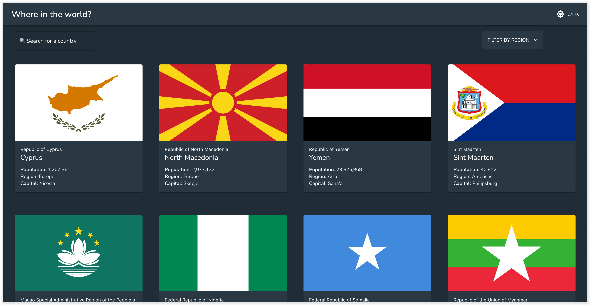

# Countries V2 API display

This project integrates with the REST Countries V2 API to pull country data and display it. It was bootstrapped with [Create React App](https://github.com/facebook/create-react-app) and uses the [MUI React theme](https://mui.com/).

🖌 Design instructions have been moved to this [Figma file](https://www.figma.com/file/yibnsJAbCTBjeBYpWjkuB0/Untitled?node-id=1%3A24).

👉 Live [demo](https://vigilant-funicular.vercel.app/)

## Requirements - basic
- [x] See all countries from the API on the homepage on load
- [x] Search for a country using an input field
- [x] Click on a country to see more detailed information on a separate page

## Requirements - extra
- [ ] E2E tests
- [x] Performance optimization
- [x] Deployment
- [x] Color mode toggle
- [x] Filter countries by region
- [ ] Click through to the border countries on the detail page

## Room to grow
### Dynamic route generation
I avoided creating routes but on a second thought, it would have been nice to be able to share country-specific URLs. It would also enable the click through via border countries described above.
### Render language names instead of language codes
This can be another fetch request to the `https://restcountries.com/v3.1/lang/{lang}` endpoint.

### Accessibility
Enhance props of MUI components for readers.

### Performance 
We can see the performance recording while the site loads below. The blue stack is the SVGs loading - approximately `200-300ms` per SVG, which isn't bad, for a total of around `1sec`. 

While searching and filtering, things to be quite fast, since the data is cached in localStorage.

#### Some other ideas
- Lazy load the list of countries using `React.useSuspense()`
- For slow networks: load an image placeholder instead of a flag. 
- Potentially use Apollo to turn this REST endpoint to a GraphQL service - which would allow for greater efficienty as well as more complex cross-cutting queries. This seems promising: [https://www.apollographql.com/docs/react/api/link/apollo-link-rest/](https://www.apollographql.com/docs/react/api/link/apollo-link-rest/)

### Tests
I would include integration tests that hardcode the search term or filter region and check whether the correct cards have been loaded in the main page.
git
## Run locally

In the project directory:

 `npm start`

Runs the app in the development mode.\
Open [http://localhost:3000](http://localhost:3000) to view it in your browser.

The page will reload when you make changes.\
You may also see any lint errors in the console.

## Test

In the project directory:

`npm test`

Launches the test runner in the interactive watch mode.

## Build
In the project directory:

`npm run build`

Builds the app for production to the `build` folder.\
It correctly bundles React in production mode and optimizes the build for the best performance.

The build is minified and the filenames include the hashes.\
